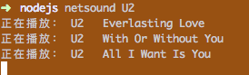

## description
一个命令行听网易云音乐的工具

## pre-installation
```bash
# mac
brew install mplayer

# ubuntu
sudo apt-get install mplayer
```

## installation
```bash
npm install netsound -g
```

## usage
```
netsound U2
```
会随机播放U2的歌曲，播放完成后自动播放下一首。




## problems
有很多歌在终端放不出来，可能是有些歌只能在客户端听（收费问题）

有些歌手专辑太多了，全抓有时候比较慢，代码里只抓了前几张专辑。

## record
[简书](http://www.jianshu.com/p/116acbd568ec)

## thanks
api部分使用了[网易云api](https://github.com/Binaryify/NeteaseCloudMusicApi/blob/master/LICENSE)中的部分代码，但是异步操作部分 将callback全部换成了promise，以方便链式调用。
